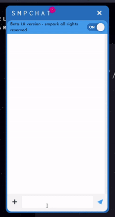
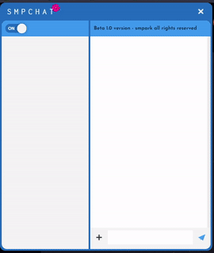
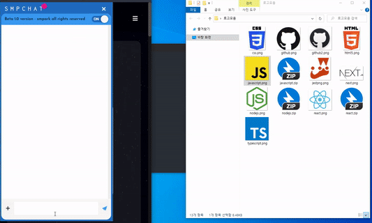
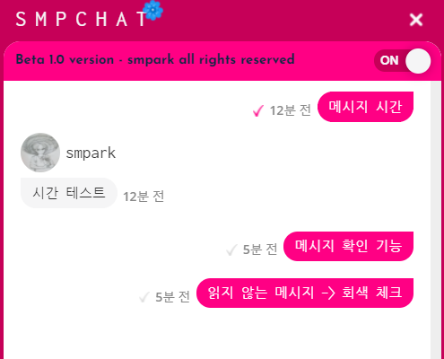

# SMP Chat Service

` SMP Chat Service`는 Resource Server에서 제공 받은 JS 파일을 통해 채팅 서비스를 이용할 수 있는 Third Party Service 입니다.  
JS 파일을 얻기 위해선 [SMP Oauth Server](https://smp-oauth.link) 가입 후 해당 하는 🔑Key와 Id를 얻어야 하며 이를 통해 Resource Server에 JS파일 요청이 가능해 집니다.

<br>

## Guide

`SMP Chat Service`는 매니저와 클라이언트의 1:1 채팅을 목적으로 만들어 졌습니다.  
매니저와 클라이언트는 서로 다수 존재 가능 하며 오직 클라이언트만 채팅 요청이 가능합니다.  
클라이언트의 채팅전송과 동시에 채팅룸이 열리며 접속해 있는 모든 관리자에게 클라이언트의 채팅방이 나타나게 됩니다.  
매니저 중 한명이 채팅룸을 클릭하면 채팅 룸에 입장하며 1:1 채팅이 완성되며,  
그 후 다른 매니저들의 채팅요청 목록에서 해당 클라이언트의 채팅방은 사라집니다.

<br>

## IDE

       

- **Tool** - `VSCode`_(v1.57)_
- **Back End** - `NodeJS(Koa)`_(v12.16.4)_, `ES6 Module`
- **Front End** - `Javascript(ES6-10)`
- **Data Base** - `MongoDB(Mongoose)`_(v4.4.6)_
- **Web Server** - `Ubuntu`_(v18.04.5 LTS)_, `Nginx`_(v1.14.0)_
- **Cloud Computing** - `AWS EC2 Prettier`

<br>

## Version

`SMP Chat Service`_(v1.0.0)_

#### Function & Example

v1.0.0

- 실시간 채팅  
  

- 프리뷰 메시지 및 알람 (manager)  
  

- 이미지 전송  
  

- 메시지 확인 & 메시지 시간   
  

- 그 외
  1. 채팅 메시지 스크롤 로드
  2. 새로고침시 연결유지
  3. 채팅룸 참여시 읽지 않은 메시지 알람 사운드
  4. 매니저 채팅방 제거 기능
  5. 서버 연결 on, off 버튼
  6. 채팅 입력 공간 컨트롤
  7. 중복 접속 막기
  8. 메시지 디비 저장
  9. ... 등등
     <br>

## Usage

#### in Browser

- HTML

```html
<div class="smpChat"></div>
```

- JS

```javascript
// Create Js
class SmpChat {
  constructor(socketIo, className) {
    this.className = className;
    this.link = null;
    this.script = null;
    this.smpChat = null;
    this.socketIo = socketIo;
  }

  // when user login
  load(userId) {
    const apiKey = process.env.API_KEY;
    const clientId = process.env.CLIENT_ID;

    // Craete script
    if (!this.script) this.script = document.createElement('script');
    this.script.src = `https://smp-resource.link/smpChat/chatService.js?CLIENTID=${clientId}`;
    this.script.defer = true;
    document.body.appendChild(this.script);

    // Craete link
    if (!this.link) this.link = document.createElement('link');
    this.link.rel = 'stylesheet';
    this.link.href = 'https://smp-resource.link/smpChat/chatService.css';
    document.body.appendChild(this.link);

    // Position Option
    const position = {
      icon: { x: '30px', y: '90%' },
      modal: { x: '30px', y: '20%' },
    };

    // SMP Chat Load
    this.script.addEventListener('load', (e) => {
      this.smpChat = new window.smpChat.setting.chatService(
        clientId,
        apiKey,
        socketIo
      );

      // Init
      this.smpChat.init(userId, this.className);

      // Position set
      this.smpChat.setPosition(position);
    });
  }

  // when user Logout
  clear() {
    if (this.script) {
      // Logout
      this.chat.logout();

      // Delete script
      this.script.parentNode.removeChild(this.script);
      this.script = null;
    }

    if (this.link) {
      // Delete link
      this.link.parentNode.removeChild(this.link);
      this.link = null;
    }

    const smpChat = document.querySelector(`.${this.className}`);

    if (smpChat) {
      // Delete documents
      while (smpChat.firstChild) {
        smpChat.removeChild(smpChat.firstChild);
      }
    }
  }
}
```

```javascript
// excute
import socketIo from 'socket.io-client';
import Smpchat from './SmpChat js File Path';

const smpChat = new SmpChat(socketIo, 'smpChat');

// When user login
const userId = 'unique userId'; // Login User ID(unique);

smpChat.load(userId);

// When user logout
smpChat.clear();
```

<br>

#### Comment

`smpark` - 이번 프로젝트는 `Resource Server`를 활용하여 Third party project를 배포해보기 위해 시작되었습니다. 크게 3가지를 생각하고 제작하였습니다.

1. 바닐라JS(모던 자바스크립트)를 사용
2. Socket을 사용한 실시간 Web Project 제작
3. 모든 기능을 직접 제작(socket.io를 제외한 라이브러리 사용 X)

포트폴리오인 만큼 학습한다는 생각으로 Socket을 사용해보았고 모든 기능을 직접 구현하며 프로젝트를 제작하였습니다.    
모던 자바스크립트를 통해 클로저, 버블링(캡처링), 이벤트 위임등을 사용해보았고 익숙해지려 노력했습니다.    
하나의 JS파일에 모든 코드가 들어가야 했기 때문에 최대한 코드를 정리하고 리펙토링을 하면서 개발했습니다.     
그럼에도 불구하고 코드가 길어질 수록 개발기간이 곱절로 늘어남을 느꼈으며 기초 설계와 UI를 확실하게 하지 않았던걸 반성하게 되었습니다.    

SMP Chat의 경우 BE도 구현되어 있지만 FE 포트폴리오 취지에 맞게 JS파일만 공개하였습니다.(BE 코드는 Resource Server를 참고 해주세요.)  
Readme는 여기까지입니다. 읽어주셔서 감사합니다.
